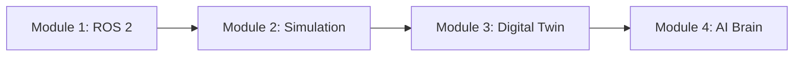

# Getting Started with Physical AI & Humanoid Robotics

Welcome to the comprehensive learning platform for **Physical AI and Humanoid Robotics**. This course will take you from the fundamentals of robot programming to building AI-powered humanoid systems.

## What You'll Learn

This curriculum is organized into 4 progressive modules:

### Module 1: ROS 2 Foundations (Weeks 1-5)
Build your foundation in robot programming with ROS 2 (Robot Operating System). You'll learn:
- Nodes, Topics, and Services
- Robot Description (URDF)
- Launch Files and Parameters
- Navigation and Motion Planning

### Module 2: Simulation (Weeks 6-8)
Master physics simulation for robot development:
- Gazebo Simulation Environment
- NVIDIA Isaac Sim (for those with NVIDIA GPUs)
- Sensor Simulation (LiDAR, Cameras, IMU)
- Physics Properties and Collision Detection

### Module 3: Digital Twin (Weeks 9-11)
Create virtual replicas of physical robots:
- Digital Twin Architecture
- Real-time Synchronization
- USD Assets and Scene Management
- Hardware-in-the-Loop Testing

### Module 4: AI Brain (Weeks 12-16)
Integrate AI and machine learning into your robots:
- Vision-Language-Action (VLA) Models
- Voice Control with OpenAI Whisper
- Cognitive Planning with LLMs
- End-to-End Robot Intelligence

## Prerequisites

Before starting, you should have:

- **Basic programming knowledge** (Python recommended)
- **Linux familiarity** (Ubuntu 22.04 recommended)
- **Git version control** basics

### Hardware Recommendations

| Component | Minimum | Recommended |
|-----------|---------|-------------|
| RAM | 8 GB | 16+ GB |
| Storage | 50 GB free | 100+ GB SSD |
| GPU | Integrated | NVIDIA RTX series |
| Robot (optional) | Any ROS-compatible | Unitree Go1/G1 |

:::tip Don't have an NVIDIA GPU?
No problem! This curriculum provides alternative paths using Gazebo for simulation, which runs on any modern computer.
:::

## How to Use This Platform

### Interactive Features

1. **AI Chatbot**: Click the chat icon to ask questions about any topic
2. **Personalization**: Set your profile to get content tailored to your experience level
3. **Urdu Translation**: Click "Translate" on any page for Urdu content

### Learning Path

We recommend following the modules in order:



However, if you have prior experience, you can jump to the module that interests you most.

## Quick Start

Ready to begin? Start with [Module 1: Introduction to ROS 2](/docs/module-1-ros/intro).

```bash
# Install ROS 2 Humble (Ubuntu 22.04)
sudo apt update && sudo apt install ros-humble-desktop

# Source ROS 2
source /opt/ros/humble/setup.bash

# Create your first workspace
mkdir -p ~/ros2_ws/src
cd ~/ros2_ws
colcon build
```

:::note
Code examples throughout this course are syntax-highlighted and can be copied with a single click.
:::

## Community & Support

- **GitHub**: Report issues and contribute
- **ROS Discourse**: Connect with the robotics community
- **AI Chatbot**: Get instant answers to your questions

Let's build the future of robotics together!
