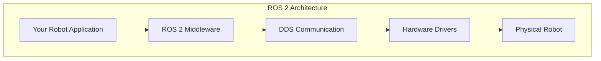

# Introduction to ROS 2

Welcome to **Module 1: ROS 2 Foundations**. This module will introduce you to the Robot Operating System 2 (ROS 2) and establish the core concepts you'll use throughout your robotics journey.

## What is ROS 2?

ROS 2 (Robot Operating System 2) is not actually an operating system, but rather a flexible framework for writing robot software. It provides:

- **Communication Infrastructure**: Tools for processes to communicate with each other
- **Hardware Abstraction**: Standard interfaces for sensors and actuators
- **Package Management**: Reusable software components
- **Development Tools**: Visualization, debugging, and testing utilities



## Why ROS 2?

ROS 2 is the industry standard for robotics development. Here's why:

| Feature | Benefit |
|---------|---------|
| **Real-time Support** | Critical for safety and precision |
| **Multi-platform** | Runs on Linux, Windows, macOS |
| **Security** | Built-in encryption and access control |
| **Scalability** | From single boards to robot fleets |
| **Community** | Thousands of packages and active support |

## ROS 2 vs ROS 1

If you've used ROS 1, here are the key differences:

```python
# ROS 1 (legacy)
import rospy
rospy.init_node('my_node')
pub = rospy.Publisher('topic', String)

# ROS 2 (modern)
import rclpy
from rclpy.node import Node

class MyNode(Node):
    def __init__(self):
        super().__init__('my_node')
        self.publisher = self.create_publisher(String, 'topic', 10)
```

:::info For Beginners
If you're new to ROS, don't worry about ROS 1. We'll focus entirely on ROS 2, which is the recommended version for new projects.
:::

## Core Concepts Preview

In this module, you'll learn about these fundamental concepts:

### 1. Nodes
The basic unit of computation in ROS 2. Each node is a process that performs a specific task.

### 2. Topics
Channels for nodes to exchange messages using publish/subscribe pattern.

### 3. Services
Request/response communication between nodes.

### 4. Actions
For long-running tasks with feedback.

### 5. Parameters
Runtime configuration for nodes.

## Setting Up Your Environment

Before we dive in, let's set up ROS 2 Humble on Ubuntu 22.04:

```bash
# Add ROS 2 apt repository
sudo apt install software-properties-common
sudo add-apt-repository universe

# Add ROS 2 GPG key
sudo apt update && sudo apt install curl -y
sudo curl -sSL https://raw.githubusercontent.com/ros/rosdistro/master/ros.key -o /usr/share/keyrings/ros-archive-keyring.gpg

# Add repository to sources list
echo "deb [arch=$(dpkg --print-architecture) signed-by=/usr/share/keyrings/ros-archive-keyring.gpg] http://packages.ros.org/ros2/ubuntu $(. /etc/os-release && echo $UBUNTU_CODENAME) main" | sudo tee /etc/apt/sources.list.d/ros2.list > /dev/null

# Install ROS 2 Humble Desktop
sudo apt update
sudo apt install ros-humble-desktop

# Source the ROS 2 setup script
echo "source /opt/ros/humble/setup.bash" >> ~/.bashrc
source ~/.bashrc
```

### Verify Installation

```bash
# Check ROS 2 installation
ros2 --help

# Run a demo
ros2 run demo_nodes_cpp talker
```

In another terminal:

```bash
ros2 run demo_nodes_cpp listener
```

You should see messages being published and received!

## What's Next?

Now that you have ROS 2 installed, proceed to [Nodes and Topics](/docs/module-1-ros/nodes-topics) to start building your first robot programs.

:::tip
The AI chatbot can help you troubleshoot installation issues. Just ask!
:::
