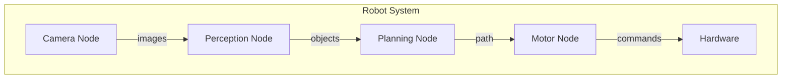
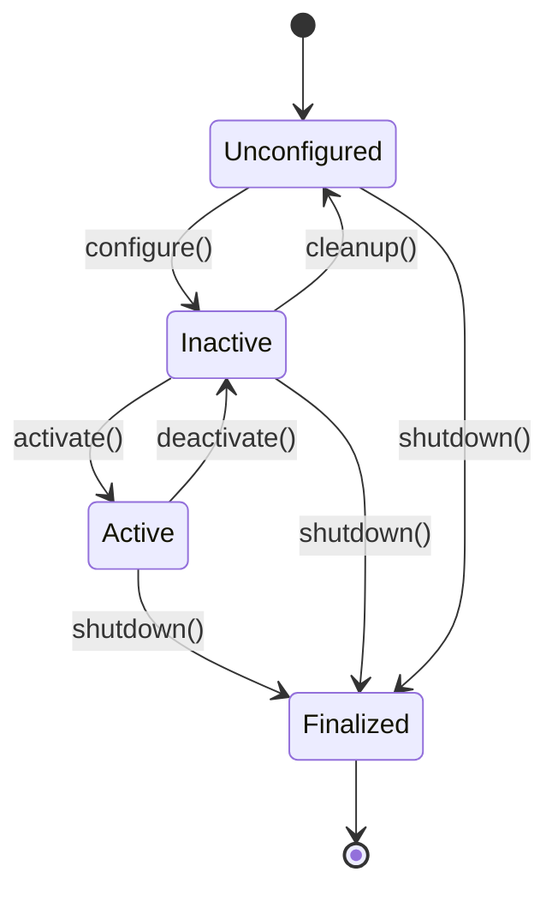

# Nodes and Topics

In this chapter, you'll learn about the two most fundamental concepts in ROS 2: **Nodes** and **Topics**. These form the backbone of any ROS 2 application.

## What is a Node?

A **node** is a single-purpose, modular unit of computation in ROS 2. Each node is responsible for one specific task:

- A **camera node** captures images
- A **motor controller node** moves wheels
- A **path planning node** calculates routes
- A **perception node** detects objects



### Creating Your First Node

Let's create a simple ROS 2 node in Python:

```python
#!/usr/bin/env python3
"""A simple ROS 2 node that logs messages."""

import rclpy
from rclpy.node import Node


class MinimalNode(Node):
    """A minimal ROS 2 node."""

    def __init__(self):
        super().__init__('minimal_node')
        self.get_logger().info('Hello from MinimalNode!')

        # Create a timer that fires every second
        self.timer = self.create_timer(1.0, self.timer_callback)
        self.counter = 0

    def timer_callback(self):
        """Called every second."""
        self.counter += 1
        self.get_logger().info(f'Timer fired {self.counter} times')


def main(args=None):
    rclpy.init(args=args)
    node = MinimalNode()

    try:
        rclpy.spin(node)  # Keep node running
    except KeyboardInterrupt:
        pass
    finally:
        node.destroy_node()
        rclpy.shutdown()


if __name__ == '__main__':
    main()
```

### Node Lifecycle

ROS 2 nodes go through a defined lifecycle:



## What is a Topic?

A **topic** is a named channel over which nodes exchange messages. Topics use a publish/subscribe pattern:

- **Publishers** send messages to a topic
- **Subscribers** receive messages from a topic
- Multiple publishers and subscribers can share a topic

### Topic Communication

```mermaid
graph LR
    P1[Publisher 1] --> T[/sensor_data]
    P2[Publisher 2] --> T
    T --> S1[Subscriber 1]
    T --> S2[Subscriber 2]
    T --> S3[Subscriber 3]
```

### Creating a Publisher

```python
#!/usr/bin/env python3
"""ROS 2 publisher example."""

import rclpy
from rclpy.node import Node
from std_msgs.msg import String


class MinimalPublisher(Node):
    """Publishes messages to a topic."""

    def __init__(self):
        super().__init__('minimal_publisher')

        # Create publisher
        # Parameters: message type, topic name, queue size
        self.publisher = self.create_publisher(String, 'chatter', 10)

        # Timer to publish every 0.5 seconds
        self.timer = self.create_timer(0.5, self.timer_callback)
        self.count = 0

    def timer_callback(self):
        """Publish a message."""
        msg = String()
        msg.data = f'Hello World: {self.count}'
        self.publisher.publish(msg)
        self.get_logger().info(f'Publishing: "{msg.data}"')
        self.count += 1


def main(args=None):
    rclpy.init(args=args)
    node = MinimalPublisher()
    rclpy.spin(node)
    node.destroy_node()
    rclpy.shutdown()


if __name__ == '__main__':
    main()
```

### Creating a Subscriber

```python
#!/usr/bin/env python3
"""ROS 2 subscriber example."""

import rclpy
from rclpy.node import Node
from std_msgs.msg import String


class MinimalSubscriber(Node):
    """Subscribes to messages from a topic."""

    def __init__(self):
        super().__init__('minimal_subscriber')

        # Create subscription
        self.subscription = self.create_subscription(
            String,           # Message type
            'chatter',        # Topic name
            self.listener_callback,  # Callback function
            10                # Queue size
        )

    def listener_callback(self, msg):
        """Handle received messages."""
        self.get_logger().info(f'I heard: "{msg.data}"')


def main(args=None):
    rclpy.init(args=args)
    node = MinimalSubscriber()
    rclpy.spin(node)
    node.destroy_node()
    rclpy.shutdown()


if __name__ == '__main__':
    main()
```

## Message Types

ROS 2 uses typed messages for communication. Common message types include:

| Package | Type | Use Case |
|---------|------|----------|
| `std_msgs` | `String`, `Int32`, `Float64` | Basic data types |
| `geometry_msgs` | `Pose`, `Twist`, `Point` | Positions and velocities |
| `sensor_msgs` | `Image`, `LaserScan`, `Imu` | Sensor data |
| `nav_msgs` | `Odometry`, `Path`, `Map` | Navigation |

### Example: Velocity Commands

```python
from geometry_msgs.msg import Twist

# Create a velocity command
cmd = Twist()
cmd.linear.x = 0.5   # Forward at 0.5 m/s
cmd.angular.z = 0.1  # Rotate at 0.1 rad/s

self.publisher.publish(cmd)
```

## ROS 2 CLI Tools

ROS 2 provides command-line tools to inspect nodes and topics:

```bash
# List all running nodes
ros2 node list

# Get info about a node
ros2 node info /minimal_publisher

# List all topics
ros2 topic list

# Show topic info
ros2 topic info /chatter

# Echo messages on a topic
ros2 topic echo /chatter

# Publish a message from CLI
ros2 topic pub /chatter std_msgs/msg/String "data: 'Hello from CLI'"

# Check publishing rate
ros2 topic hz /chatter
```

## Quality of Service (QoS)

QoS policies control how messages are delivered:

```python
from rclpy.qos import QoSProfile, ReliabilityPolicy, HistoryPolicy

# Define QoS profile
qos = QoSProfile(
    reliability=ReliabilityPolicy.RELIABLE,  # Guaranteed delivery
    history=HistoryPolicy.KEEP_LAST,
    depth=10
)

# Use in publisher/subscriber
self.publisher = self.create_publisher(String, 'chatter', qos)
```

### QoS Presets

| Preset | Use Case |
|--------|----------|
| `qos_profile_sensor_data` | High-frequency sensor streams |
| `qos_profile_system_default` | General purpose |
| `qos_profile_services_default` | Service calls |
| `qos_profile_parameters` | Parameter events |

## Practice Exercise

Create a robot "speedometer" system:

1. **velocity_publisher**: Publishes random velocities to `/robot_velocity`
2. **speedometer**: Subscribes to `/robot_velocity` and logs the speed

:::tip Challenge
Can you add a third node that calculates the average velocity over the last 10 messages?
:::

## What's Next?

You've learned the fundamentals of ROS 2 communication! Continue exploring more concepts in the [Module 2: Simulation](/docs/module-2-simulation/intro) section, or revisit the [ROS 2 Introduction](/docs/module-1-ros/intro).
