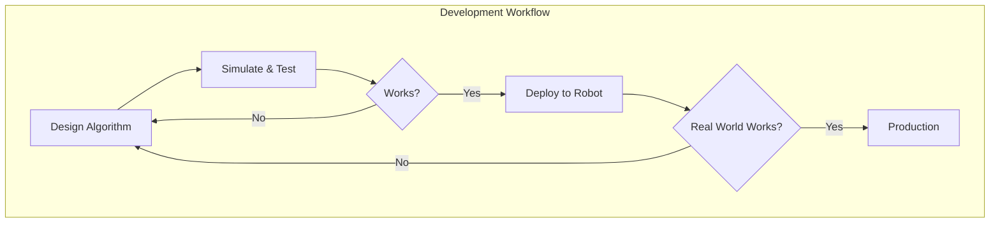
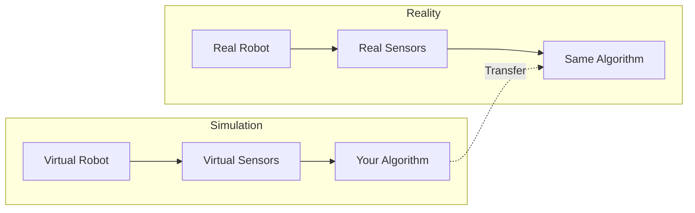

# Introduction to Robot Simulation

Welcome to **Module 2: Simulation**. In this module, you'll learn to use physics simulators to develop and test your robots in virtual environments before deploying to real hardware.

## Why Simulate?

Simulation is a cornerstone of modern robotics development:

| Benefit | Description |
|---------|-------------|
| **Safety** | Test dangerous scenarios without risk |
| **Speed** | Run faster than real-time |
| **Cost** | No hardware wear or breakage |
| **Reproducibility** | Repeat exact scenarios for testing |
| **Scale** | Run thousands of tests in parallel |



## Simulation Platforms

We'll cover two major simulation platforms:

### Gazebo (Open Source)

**Best for**: General robotics, ROS 2 integration, beginners

- Open-source and free
- Native ROS 2 integration
- Runs on any modern computer
- Large community and resources

```bash
# Install Gazebo Harmonic
sudo apt install ros-humble-ros-gz
```

### NVIDIA Isaac Sim

**Best for**: AI training, photorealistic rendering, large-scale simulation

- Professional-grade physics
- Photorealistic rendering
- AI/ML training pipelines
- GPU-accelerated (requires NVIDIA GPU)

:::info Hardware Note
Isaac Sim requires an NVIDIA RTX GPU. If you don't have one, we'll focus on Gazebo which runs on any computer.
:::

## What You'll Learn

### In This Module

1. **Gazebo Fundamentals**: World creation, robot spawning, sensors
2. **Physics Properties**: Gravity, friction, collision detection
3. **Sensor Simulation**: LiDAR, cameras, IMU, depth sensors
4. **Isaac Sim Basics**: USD assets, physics engine, rendering
5. **ROS 2 Integration**: Connecting simulation to your robot code

### Sample: Simulated Robot

```python
# Launch a simulated robot in Gazebo
import subprocess

# Launch Gazebo with empty world
subprocess.run([
    'ros2', 'launch', 'gazebo_ros', 'gazebo.launch.py',
    'world:=empty.sdf'
])
```

## Sim-to-Real Transfer

The ultimate goal of simulation is **sim-to-real transfer** - algorithms that work in simulation should work on real robots.



### Keys to Successful Transfer

1. **Accurate Physics**: Match real-world properties
2. **Sensor Noise**: Add realistic noise to simulated sensors
3. **Domain Randomization**: Vary parameters during training
4. **System Identification**: Measure real robot parameters

## Getting Started

Let's verify your simulation environment:

```bash
# Check Gazebo installation
gz sim --version

# Launch a sample world
ros2 launch ros_gz_sim gz_sim.launch.py gz_args:=empty.sdf

# In another terminal, list Gazebo topics
ros2 topic list
```

You should see Gazebo topics available in ROS 2!

## What's Next?

Continue to the next chapter to start building your first simulated robot world.

:::tip
The AI chatbot can help you troubleshoot simulation issues. Just ask about any errors you encounter!
:::
