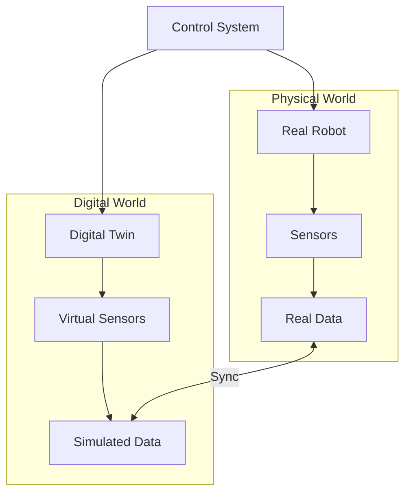
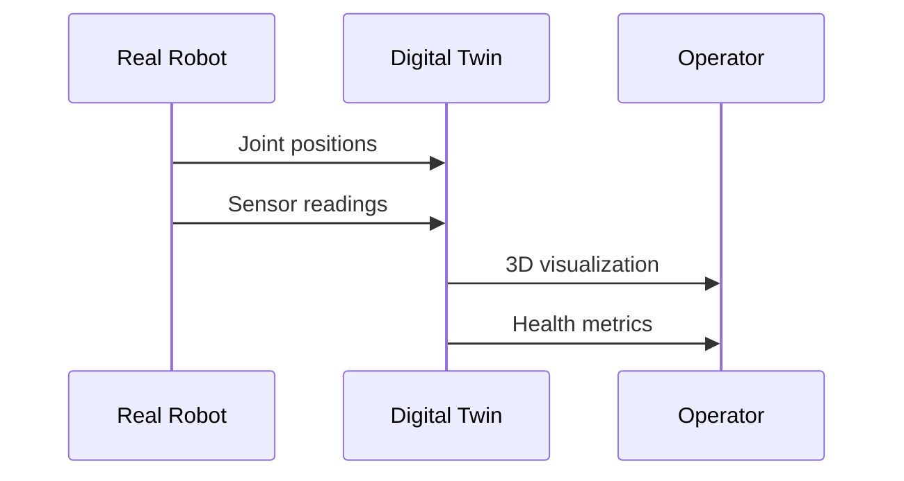
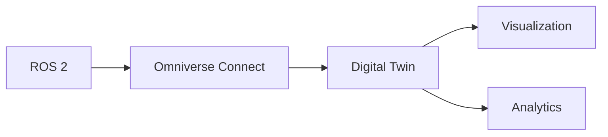

# Introduction to Digital Twins

Welcome to **Module 3: Digital Twin**. In this module, you'll learn to create virtual replicas of physical robots that stay synchronized in real-time.

## What is a Digital Twin?

A **digital twin** is a virtual representation of a physical system that:

- Mirrors the real system's state in real-time
- Uses the same control logic as the physical system
- Enables testing without affecting the real system
- Provides predictive capabilities



## Digital Twin vs Simulation

| Aspect | Simulation | Digital Twin |
|--------|------------|--------------|
| **Purpose** | Development & testing | Operations & monitoring |
| **Timing** | Faster than real-time | Real-time synchronized |
| **Data** | Synthetic | Real + synthetic |
| **Lifetime** | Project duration | Asset lifetime |
| **Updates** | Manual | Continuous |

## Applications in Robotics

### 1. Real-Time Monitoring



### 2. Predictive Maintenance

Detect problems before they cause failures:

- Motor wear patterns
- Joint degradation
- Battery health
- Sensor drift

### 3. What-If Analysis

Test changes safely:

- New control algorithms
- Different environments
- Edge cases and failures

## Technology Stack

### OpenUSD (Universal Scene Description)

The foundation for digital twins:

```python
# Example: Creating a USD stage for digital twin
from pxr import Usd, UsdGeom

# Create a new stage
stage = Usd.Stage.CreateNew("robot_twin.usda")

# Add a robot reference
robot = stage.DefinePrim("/World/Robot", "Xform")
robot.GetReferences().AddReference("./robot.usd")

# Save
stage.Save()
```

### Omniverse Connect

Real-time synchronization framework:



## What You'll Learn

In this module, we'll cover:

1. **Digital Twin Architecture**: Design patterns for robotic twins
2. **USD for Robots**: Creating and managing robot assets
3. **Real-Time Sync**: Connecting physical robots to twins
4. **NVIDIA Isaac Sim**: Professional digital twin platform
5. **Analytics & Prediction**: Extracting insights from twin data

## Prerequisites

Before starting, ensure you have:

- Completed Module 1 (ROS 2 fundamentals)
- Completed Module 2 (Simulation basics)
- Understanding of robot state representation

:::info Hardware Note
For full NVIDIA Isaac Sim features, an RTX GPU is recommended. However, we'll provide alternatives for those without NVIDIA hardware.
:::

## What's Next?

Continue to learn about Digital Twin architecture and start building your first synchronized robot twin.

:::tip
Ask the AI chatbot about specific digital twin use cases for your robot project!
:::
