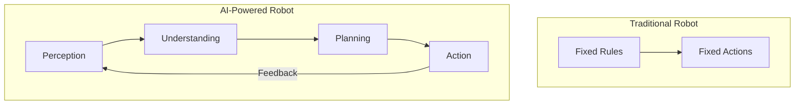
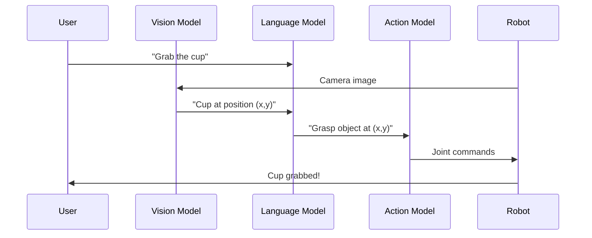
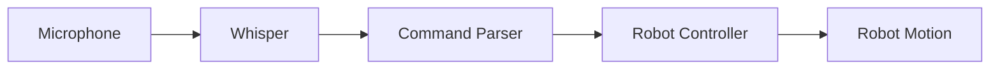
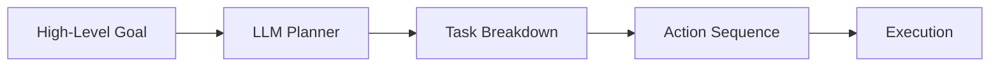

# Introduction to AI-Powered Robotics

Welcome to **Module 4: AI Brain**. This is where robotics meets artificial intelligence - you'll learn to give your robots the ability to understand, reason, and act intelligently.

## The AI Revolution in Robotics

Traditional robots follow pre-programmed instructions. AI-powered robots can:

- **Understand** natural language commands
- **See** and interpret the world through vision
- **Plan** complex sequences of actions
- **Learn** from experience and improve



## Vision-Language-Action (VLA) Models

VLA models are the cutting edge of robot AI:

| Component | Function | Example |
|-----------|----------|---------|
| **Vision** | Understand images | "I see a red cup on the table" |
| **Language** | Understand commands | "Pick up the red cup" |
| **Action** | Generate movements | Arm trajectory to grasp cup |

### How VLA Works



## Key Technologies

### 1. Voice Control (OpenAI Whisper)

Convert speech to robot commands:

```python
import whisper

# Load model
model = whisper.load_model("base")

# Transcribe audio
result = model.transcribe("command.wav")
command = result["text"]  # "Move forward two meters"
```

### 2. Vision Understanding

Process camera input for scene understanding:

```python
# Using a vision model for object detection
from transformers import pipeline

detector = pipeline("object-detection")
objects = detector(robot_camera_image)

# Returns: [{"label": "cup", "score": 0.95, "box": {...}}]
```

### 3. Language to Actions (LLMs)

Use large language models for planning:

```python
from openai import OpenAI

client = OpenAI()

response = client.chat.completions.create(
    model="gpt-4o-mini",
    messages=[
        {"role": "system", "content": "You are a robot planner. Convert commands to action sequences."},
        {"role": "user", "content": "Clean the room"}
    ]
)

# Returns: ["navigate_to(dirty_area)", "pick_up(trash)", "move_to(bin)", "drop(trash)"]
```

## What You'll Build

In this module, you'll create:

### Voice-Controlled Robot



### Cognitive Planning System



## Prerequisites

Before starting, you should:

- Complete Modules 1-3
- Have Python 3.11+ installed
- Basic understanding of neural networks (helpful but not required)

### Required Packages

```bash
pip install openai anthropic transformers torch whisper
```

:::caution API Keys Required
This module uses OpenAI and Anthropic APIs. You'll need API keys with available credits.
:::

## The Path Forward

This module covers:

1. **Voice Control**: Speech-to-text with Whisper
2. **Vision Understanding**: Object detection and scene analysis
3. **Language Models**: Using LLMs for robot planning
4. **VLA Integration**: Combining all components
5. **End-to-End Systems**: Building complete AI-powered robots

## Ethical Considerations

As you build AI-powered robots, consider:

- **Safety**: AI can make unexpected decisions
- **Privacy**: Cameras and microphones collect data
- **Transparency**: Users should understand robot capabilities
- **Reliability**: AI systems can fail in unexpected ways

:::note
We'll discuss safety considerations throughout this module.
:::

## What's Next?

Continue to the next chapter to start building voice control for your robot.

:::tip
The AI chatbot is powered by similar technology to what you'll learn in this module. Try asking it about VLA models!
:::
